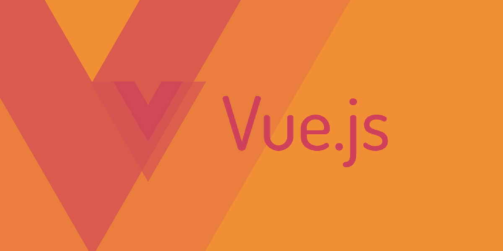

# vuejs-omnibus
A collection of Code Snippet, tutorials and mini project of Vue.js, Vuex, axios and different other technologies.This is a repository to discover Vue for beginners to advanced

## What is Vue.js?
Vue.js (commonly referred to as Vue; pronounced /vjuː/, like view) is an open-source JavaScript framework for building user interfaces and single-page applications.[wikipedia](https://en.wikipedia.org/wiki/Vue.js)
