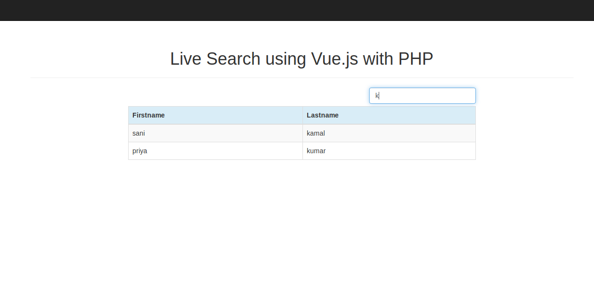

# Live Search using Vue.js with PHP

## Getting Started
I've used CDN for Bootstrap, Vue.js and Axios.js so, you need internet connection for them to work.

## Creating our Database
1. Open phpMyAdmin.
2. Click databases, create a database and name it as `live_search_db`.
3. After creating a database, click the `Import` and upload the `live_search_db.sql`.
4. Click the Go button.
